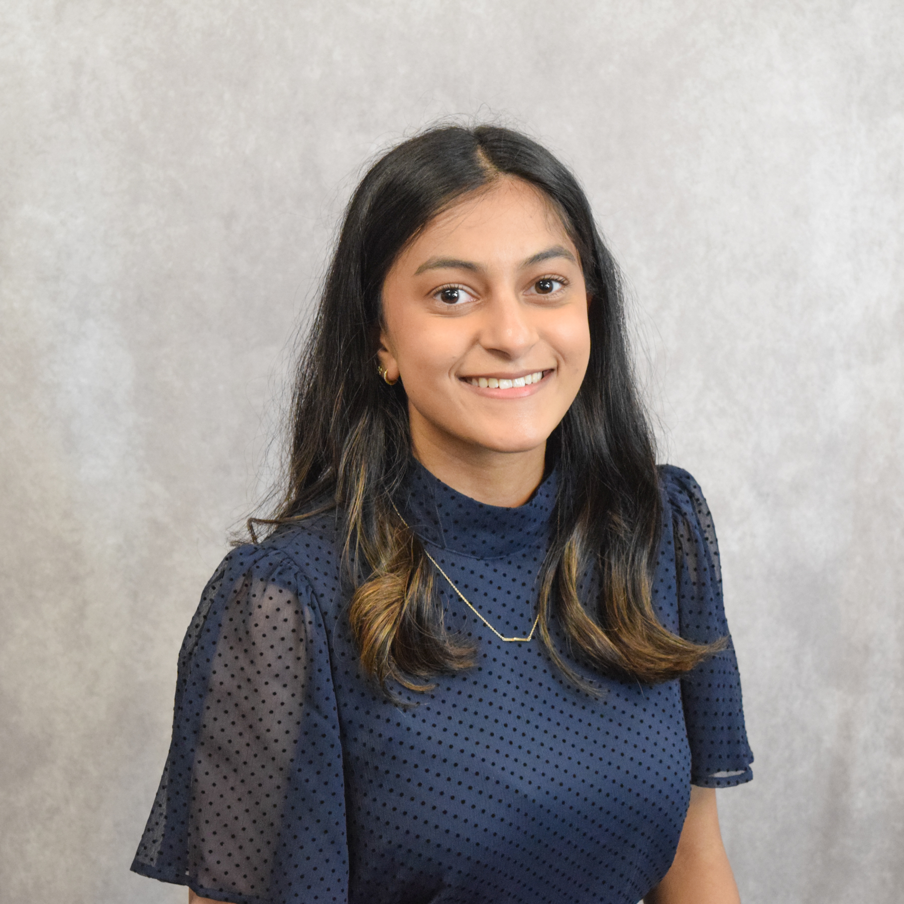

<header>
  

    
  

  

    Emma Abraham 
    B.S. Computer Science 
    Cybersecurity Minor
  

  <nav>
    <ul>
      <li><a href="www.linkedin.com/in/emma-a-abraham">LinkedIn</a></li>
      <li><a href="https://github.com/abraha9">Github</a></li>
      <li><a href="mailto:abraha9@clemson.edu">Email</a></li>
      <li><a href="EmmaAbrahamResume.pdf">Resume</a></li>
    </ul>
  </nav>

</header>

<section class="content">
  
  <h2>About Me</h2>
  
I'm a junior undergraduate student at Clemson University.  
  I'm currently pursuing a B.S. in Computer Science with a minor in Cybersecurity.

  

  <h2>Experience</h2>

  <h3>Student Assistant V at Clemson University</h3>
  <strong>Duration:</strong> June 2024 - Present 
  <strong>Responsibilities:</strong>
  <ul style="list-style-type:circle;">
      <li>Provide IT customer support via phone call, chat, email, or in person</li>
      <li>Make quick decisions for the best course of action regarding each issue.</li>
      <li>Follow procedures to maximize efficiency between the Help Desk and other areas of CCIT.</li>
  </ul>
  
<strong>Skills:</strong> Slack, Chervell Service Management, Problem Analysis

  <h3>Brand Ambassador at American Eagle Outfitters, Inc</h3>
  <strong>Duration:</strong> June 2021 - June 2024 
  <strong>Responsibilities:</strong>
   <ul style="list-style-type:circle;">
      <li>Approached strangers and interacted in natural conversation with the goal of developing brand loyalty.</li>
      <li>Designed, filled, and arranged eye-catching product floorsets to increase sales.</li>
      <li>Communicated product information with confidence.</li>
  </ul>
  
<strong>Skills:</strong> Sales, Communication

  

  <h2>Campus Involvement</h2>

  <h3>Clemson Association for Information Systems (AIS)</h3>
  

<strong>President</strong> | March 2024 - Present 
  <strong>Responsibilities:</strong>
   <ul style="list-style-type:circle;">
      <li>Plan and host events with companies to help members network and gain industry experience.</li>
  </ul>
  

<strong>Vice President</strong> | September 2023 - March 2024 
  <strong>Responsibilities:</strong>
   <ul style="list-style-type:circle;">
      <li>Assist the president and other officers in completing their duties.</li>
  </ul>
  

<strong>Marketing Coordinator</strong> | September 2022 - March 2024 
  <strong>Responsibilities:</strong>
   <ul style="list-style-type:circle;">
      <li>Promote events on social media. Reach potential members and provide an ease of communication.</li>
  </ul>
  
<strong>Skills:</strong> Event Planning, Leadership, Team Management, Problem Solving, Networking, Graphic Design, Attention to Detail

  <h3>Clemson Forge</h3>
  <strong>Chair of Professional Development</strong> | June 2024 - Present 
  <strong>Responsibilities:</strong>
   <ul style="list-style-type:circle;">
      <li>Assist in professional development aspects, help organize development events, and provide useful links to look towards.</li>
      <li>Help the President get speakers for events.</li>
  </ul>
  
<strong>Skills:</strong> Communication, Organization

  

  <h2>Awards and Achievements</h2>
   <ul>
      <li><strong>President's List</strong> - Fall 2023</li>
      <li><strong>President's List</strong> - Spring 2024</li>
  </ul>

  

  <h2>Projects</h2>

  <h3>Solace Charities</h3>
  
My current passion project is redoing the US website for <a href="https://www.solacecharities.org/">Solace Charities</a>. Solace Charities is dedicated to supporting sick and underprivileged children and their families in Kerala, India. They provide housing, travel, and financial support for these families. 
  <strong>Skills:</strong> Markdown, Squarespace

  <h3>Clemson AIS Website</h3>
  
As President, I created the website for <a href="https://cuais3.wixsite.com/clemsonais">Clemson Association for Information Systems</a>. This is the first website I ever created. In the future, I plan on remastering this website and move it over to GitHub. 
  <strong>Skills:</strong> Web Design

<section>
  
Blah blah blah
  

</section>
